<!-- ============================================================ -->
<!--  🌼 VILA PIXEL · README de perfil                              -->
<!--  Substitua tudo que estiver entre [COLCHETES] e também          -->
<!--  SEU_USUARIO (nas URLs) pelo seu usuário do GitHub.             -->
<!-- ============================================================ -->
 

 

## 🍃 Sobre mim

> **\* INGRID OBANA:** Oi, viajante! Eu construo aplicações de ponta a ponta — do front em **Angular** ao back em **Spring**. 🌱
>
> **\* INGRID OBANA:** Gosto de código limpo, interfaces acolhedoras e de aprender algo novo a cada estação.
>
> **\* INGRID OBANA:** Fique à vontade para explorar a vila! ✨

 

## 🎒 Inventário de Habilidades

⚔️ itens equipados

 

🧺 bolsa extra (adicione suas outras ferramentas aqui)

 

<!-- Exemplos para descomentar/adaptar:

-->

 

## 📜 Diário de Missões

<table>
  <tr>
    <td width="33%" valign="top">
      <h3>🌸 [Nome do Projeto 1]</h3>
      
✅ concluída

      
[Descrição curta do projeto: o que ele resolve e para quem.]

      

        
        
      

      
🗺️ <a href="[link do repositório]">ver missão</a>

    </td>
    <td width="33%" valign="top">
      <h3>🍄 [Nome do Projeto 2]</h3>
      
🔄 em andamento

      
[Descrição curta do projeto: o que ele resolve e para quem.]

      

        
        
      

      
🗺️ <a href="[link do repositório]">ver missão</a>

    </td>
    <td width="33%" valign="top">
      <h3>🌻 [Nome do Projeto 3]</h3>
      
✅ concluída

      
[Descrição curta do projeto: o que ele resolve e para quem.]

      

        
        
      

      
🗺️ <a href="[link do repositório]">ver missão</a>

    </td>
  </tr>
</table>

 

## ⭐ Status do Personagem

  

 

## 🏠 Vila dos Contatos

🤝 bata na porta de qualquer casinha

  

<!--  -->

 

🌼 🍃 🌷 🍃 🌼

